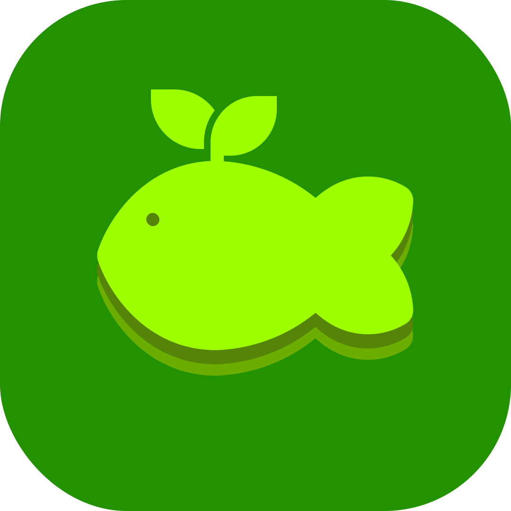

  

# 🐟 OpenFishTools

**OpenFishTools** is a professional-grade Adobe After Effects CEP extension designed to optimize motion graphics workflows. It combines core creative utilities and a sleek dashboard to help you work faster.

---

## ✨ Key Features

### 📈 Graph Editor (Beta)
* Visual easing control with Cubic Bezier interface.
* Preset library for common motion curves.

### 🛠️ Creative Toolbox
* **Layer Utilities**: Freeze Frame, Fit to Comp, Drop Shadow, and Mirroring.
* **One-Click Creation**: Instant creation of Shapes, Solids, Nulls, Cameras, and Adjustment Layers.
* **Effect Shortcuts**: Rapidly apply Fill, Tint, Blur, Lumetri Color, and Curves.
* **Anchor Point Grid**: 3x3 grid for fast anchor point repositioning.

### 🎨 Integrated Dashboard
* **System Info**: Track OS, AE version, and project status.
* **Session Timer**: Built-in stopwatch for production tracking.
* **Theme Customization**: UI color settings.

---

## 🚀 Installation

### Windows (Automated)

Click the button below to download the installer directly:

> **Note:** If the link opens as text in your browser, press **Ctrl + S** to save it as `installer.bat`.

1.  **Download** the file using the button above.
2.  Right-click `installer.bat` and select **Run as Administrator**.
3.  The script will automatically handle registry settings and file placement.
4.  **Restart After Effects**.

---

## 📖 Usage
1.  Open After Effects.
2.  Go to **Window > Extensions > Fish Tools**.
3.  Ensure **"Allow Scripts to Write Files and Access Network"** is checked in *Preferences > Scripting & Expressions*.

---

## 🛠️ Tech Stack
* **UI**: HTML5, CSS3, ES6 JavaScript.
* **Core**: ExtendScript for After Effects.
* **Platform**: Adobe CEP.

---

## 📜 License
Distributed under the **GNU General Public License v3**.

---

## 💖 Support
* [Donate via PayPal](https://www.paypal.com/paypalme/cutefishae)
* **QRIS Support**: Available in the Settings tab.

---
*Developed by cutefishaep.*
